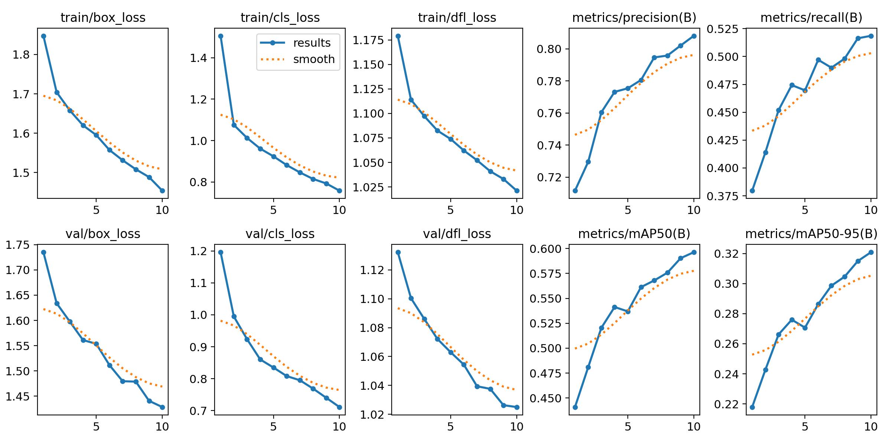

# yolov8 人脸检测识别

## 0x1 数据集准备

yolo支持多种数据集格式，详细请看官网 https://docs.ultralytics.com/datasets/

WIDER Face(人脸目标检测数据集) http://shuoyang1213.me/WIDERFACE/

人脸图像 https://drive.google.com/file/d/1KfmeBY7N0hNhg79UIgdEhbNxGSrDPWSm/view?usp=drive_link

使用yolov8模型目标检测，再使用resnet或者OpenCV对人脸图像进行分类

## 0x2 数据处理

先下载这三个，解压到WIDER_FACE，我们只需要这几个数据，从左到右，x和y的最小值坐标，box的宽和高


把数据进行转换成yolo支持的coco8格式(WIDER_FACE_COCO8.py)，即比例形式

x_center = (xmin + boxw/2)/img_with

y_center = (ymin + boxh/2)/img_height

box_width = boxw / img_width

box_height = boxh / img_height

处理
```angular2html
python WIDER_FACE_COCO8.py
```

验证是否文件齐全
```angular2html
python verify.py
```

绘制坐标是否正确
```angular2html
python draw.py
```

## 0x3 模型训练
配置文件在config/coco8.yaml

这里我用的设备是RTX 4070 12G

单线程 batch=8 跑出来大概需要空闲显存10G

```angular2html
python train_yolov8.py
```
``
PyTorch: starting from 'runs\detect\train2\weights\best.pt' with input shape (1, 3, 640, 640) BCHW and output shape(s) (1, 5, 8400) (5.9 MB)
``

``
Results saved to runs\detect\train22
``

左边标签，右边predict



## 0x4 OpenCv训练
#### 1.数据处理
提取所有人名 放入config.py
```angular2html
python FaceDataHandle.py
```
#### 2.训练模型
训练opencv的模型 保存为model.yml
```angular2html
python opencv_faceClassify/train.py
```

## 0x5 模型测试

```angular2html
python run.py
```


Base on yolov8 and wider face dataset, training a model that can be used
